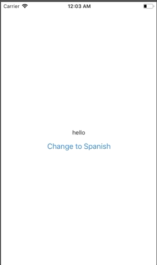

# react-multilang-starter

Easy and efficient multilingual in react/react-native apps using Context API.

## For Full Tutorial
Please visit [HERE](https://medium.com/@sarmadshah/easy-and-efficient-multi-language-in-react-react-native-apps-using-context-api-bfa637468d1c)
